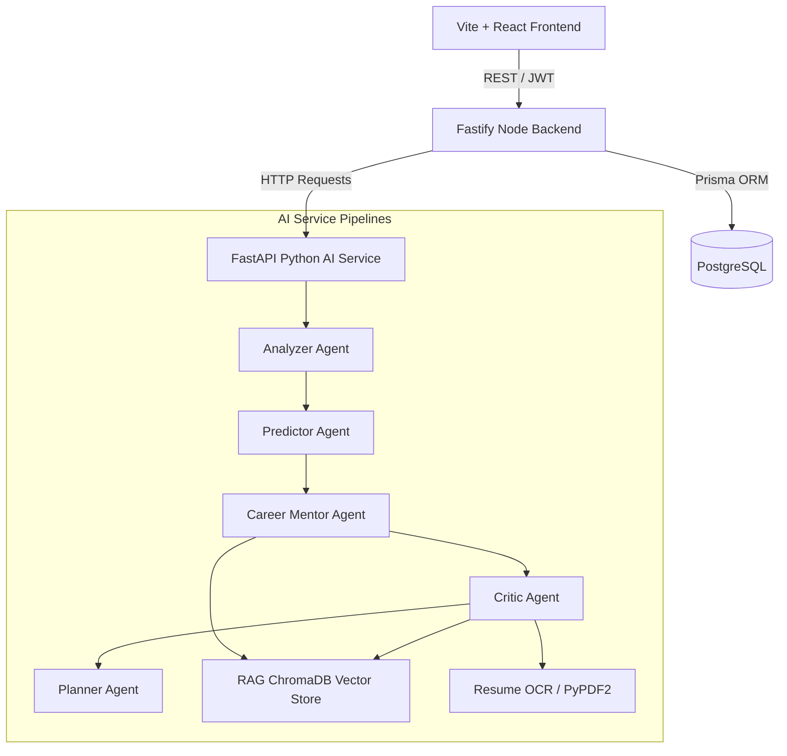

# Guardian AI Architecture

Guardian AI is structured as a decoupled multi-service system comprising a user interface, an API Gateway/Data service, and a Python AI Service housing the machine learning models and LLM agent pipelines.

## System Architecture

## Service Boundaries

### 1. React Frontend (`/frontend`)
- Responsible for the UI dashboard, login, profile onboarding, ATS resume score visualizer, weekly report trends, and what-if simulation interface.

### 2. Node.js Fastify API (`/backend`)
- Serves as the primary source of truth for transactional user data (profiles, skills, projects, activity logging, JWT authentication).
- Validates input formats strictly via Zod.
- Communicates with PostgreSQL.
- Invokes the AI service endpoints synchronously when running evaluations.

### 3. FastAPI Python AI Service (`/ai-service`)
- Houses predicting models (Placement, Burnout, Backlogs, Project Slippage) and runs LLM orchestration.
- Uses a sequential agent pipeline where each agent appends context to a shared payload object:
  1. **Analyzer**: Reads profile and activities, compiles status JSON.
  2. **Predictor**: Runs numeric models (XGBoost/scikit-learn) and outputs risk percentages.
  3. **Career Mentor**: Inspects target roles vs skills to build roadmaps, grounded by RAG.
  4. **Critic**: Evaluates resume / projects, highlights weaknesses.
  5. **Planner**: Creates daily/weekly action lists.

## Database Entity Relationships (Prisma)

- **User**: The root model containing authentication and reference hashes.
- **Profile**: A 1-to-1 extension of User storing CGPA, attendance, DSA solved count, and target career roles.
- **Skill**: User skills with a self-assessed proficiency score (1-5).
- **Project**: User projects with descriptions and tech stacks.
- **Activity**: Continuously logged hourly activities (coding, study, sleep, etc.) representing the user's workload.
- **Prediction**: Cached results of risk assessments for performance trending.
- **Resume**: Record of uploaded PDFs, parsed metadata, and ATS scores.
